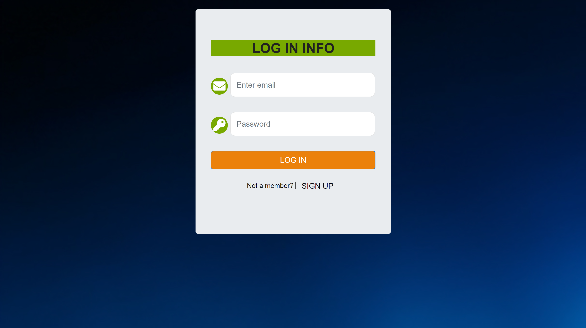
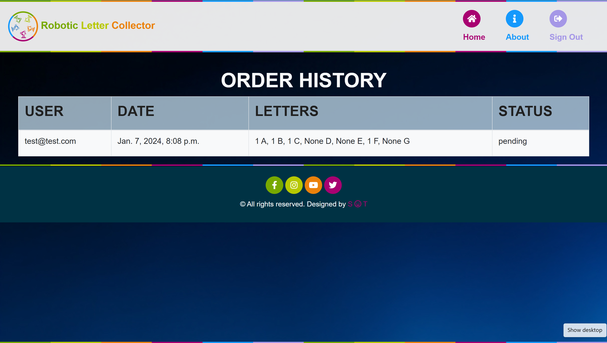
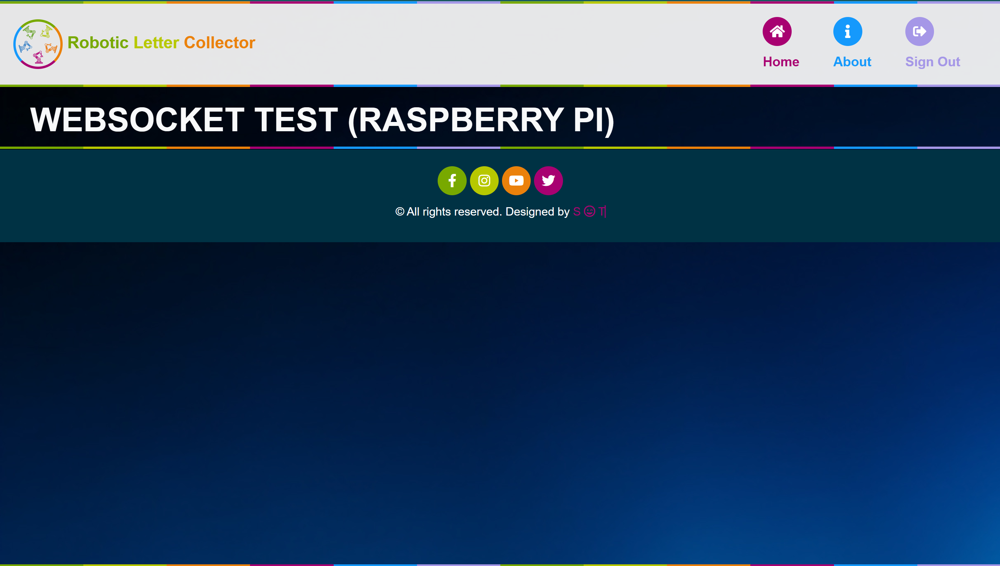

# Robotic Letter Collector

## Table of Contents
- [Installation](#installation)
- [Usage](#usage)
- [API Endpoints](#api-endpoints)

## Installation
- ### To get started with the project, follow these steps:

    1. #### Enter the Root folder directory of the project ;'project/'

    2. #### Create a virtual environment (optional but recommended):
        ```python -m venv venv```
        ```Set-ExecutionPolicy -Scope Process -ExecutionPolicy Bypass```
        ```venv\Scripts\activate```
    
    3. #### Install project dependencies from the requirements.txt file:
        ```pip install -r requirements.txt```
        ```python.exe -m pip install --upgrade pip```

    4. #### Database migrations:
        ```python manage.py migrate```

    5. #### Start the development server:
        ```python manage.py runserver```

## Usage
- Place an order by select random up to 4 letters.

## API Endpoints
- ### Home URL: http://127.0.0.1:8000/

    1. #### Register a New User
        ##### URL: http://127.0.0.1:8000/register
        - ##### 
            . 

    2. #### Log in a User
        ##### URL: http://127.0.0.1:8000/login/
        - ##### 
            . 

    3. #### Log out a User From Session
        ##### URL: http://127.0.0.1:8000/api/logout/
        - ##### 
            . 

    4. #### View order history:
        ##### Endpoint url: http://127.0.0.1:8000/order/
        - ##### 
            . 

    5. #### Raspberry Pi Websocket API:
        ##### Enpoint url: 'ws://127.0.0.1:8000/ws/raspberry_pi/'
        - ##### For Testing:
            1. Naviage to the Endpoint: http://127.0.0.1:8000/api/raspi/
            2. Make and Order, You wil see the order you make will be display to the above Url( http://127.0.0.1:8000/api/raspi/)
            

    6. #### Run these command when ever you delete the database
        ```python manage.py migrate```
